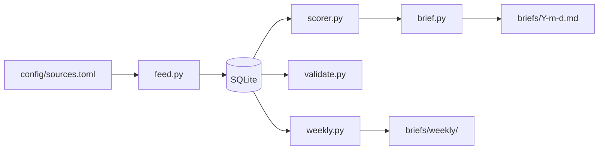

# Architecture

OpsRisk Radar has six commands built on a shared ETL core: fetch, store, score, brief, validate, and weekly. Each command is backed by a discrete Python module.

## Pipeline Overview

## Stage 1: Configuration

**File:** `src/opsrisk/config.py`

The system is configured through a single TOML file, `config/sources.toml`. The `load_config()` function reads this file and returns an `AppConfig` dataclass containing:

- **Feed list** — each entry specifies a name, URL, category (logistics / procurement / operations), and an enabled flag
- **Scoring weights** — the five dimension weights used in composite score calculation

The dataclass defaults serve as fallbacks when the TOML file omits optional sections.

## Stage 2: Feed Ingestion

**File:** `src/opsrisk/feed.py`

`fetch_all_feeds()` takes a list of `FeedSource` objects and fetches them concurrently using `httpx.AsyncClient` with `asyncio.gather`. Per-feed:

1. HTTP GET the RSS/Atom XML (30-second timeout, follow redirects)
2. Parse with `feedparser` into entry objects
3. Strip HTML tags from summaries, truncate to 500 characters
4. Parse publication dates from feedparser's `published_parsed` struct
5. Return a list of `Article` domain objects

Failed feeds are logged as warnings and skipped; a single broken feed does not block the pipeline.

## Stage 3: Persistence

**File:** `src/opsrisk/database.py`

SQLite via the `sqlite3` stdlib module. Two tables:

**`articles`** — the raw article data:
- `url` (unique, used for deduplication)
- `title`, `published`, `source_name`, `source_category`
- `summary`, `raw_content`
- `is_scored` (flag for incremental processing)

**`scores`** — the five dimension scores plus composite:
- `article_id` (unique foreign key to articles)
- `disruption_risk`, `business_impact`, `strategic_relevance`, `actionability`, `signal_strength`
- `composite_score`

`upsert_article()` uses `INSERT ... ON CONFLICT(url) DO UPDATE` so re-running the pipeline updates existing articles instead of duplicating them. The pipeline processes only articles where `is_scored = 0`, enabling incremental scoring after new fetches.

## Stage 4: Scoring

**File:** `src/opsrisk/scorer.py`

The scoring engine is documented in detail in [methodology.md](methodology.md). At the architecture level:

1. `score_article()` evaluates raw keyword pattern matches across five dimensions
2. `_apply_penalties()` adjusts scores for market-report articles and market-research-heavy sources
3. `compute_composite()` calculates the weighted average
4. `make_article_score()` orchestrates all three and returns an `ArticleScore`

The scorer is called by `__main__.py`'s `_run_score()` function, which iterates over unscored articles, retrieves each article's title and summary from the database, scores it, and persists the result.

## Stage 5: Brief Generation

**File:** `src/opsrisk/brief.py`

`generate_brief()` takes scored article rows from the database and assembles them into a `DailyBrief` domain object. The brief:

1. Assigns a severity label (CRITICAL / HIGH / MEDIUM / LOW) based on the composite score
2. Renders a `top_risks` summary table of the top 5 articles by composite score
3. Provides a `_category_group()` breakdown with per-article score bars, source metadata, and the first ~300 characters of each summary
4. Appends a methodology note explaining the scoring dimensions

`render_markdown()` produces the full Markdown document. `write_brief()` saves it to `briefs/YYYY-MM-DD.md`.

## Stage 6: Validation

**File:** `src/opsrisk/validate.py`

`run_validations(db)` runs 15 integrity checks against the database, grouped into four categories:

1. **Articles** — confirms `url`, `title`, `source_name`, `source_category`, `fetched_at` are never null or empty
2. **Scores** — confirms `composite_score` and all five dimension scores are within [0, 10], and `scored_at` is never null
3. **Relationships** — confirms no orphaned score rows and all scored articles have matching scores
4. **Source concentration** — prints article count by source and warns if any source exceeds 70% dominance

Returns `True` if all checks pass, `False` otherwise. The CLI uses the return code to exit with 0 or 1.

## Stage 7: Weekly Analytics

**File:** `src/opsrisk/weekly.py`

`generate_weekly_report(db, briefs_dir)` queries the last 7 days of scored articles and produces a Markdown trend report under `briefs/weekly/YYYY-MM-DD.md`. The report includes:

1. **Executive summary** with severity distribution bar chart
2. **Top 5 signals** by composite score
3. **Top Risk Signal card** with per-dimension score bars
4. **Average scores by source** with trend bars
5. **Average disruption risk by source category**
6. **Source concentration** breakdown
7. **Risk theme frequency analysis** using keyword pattern matching against article titles
8. **Data quality note** referencing the validate command

All data comes from the existing `articles` and `scores` tables via SQL aggregation. No scoring logic is invoked during report generation.

## CLI Entry Point

**File:** `src/opsrisk/__main__.py`

The `opsrisk` CLI exposes six subcommands:

| Command | Action |
|---------|--------|
| `fetch` | Ingest RSS feeds |
| `score` | Score unscored articles |
| `brief` | Generate daily brief |
| `validate` | Run data quality checks |
| `weekly` | Generate weekly trend report |
| `run` | Fetch -> Score -> Brief (full pipeline) |

Each subcommand loads configuration, instantiates the database, runs its stage, and closes the connection. This design lets each stage be run independently for debugging or incremental operation.
