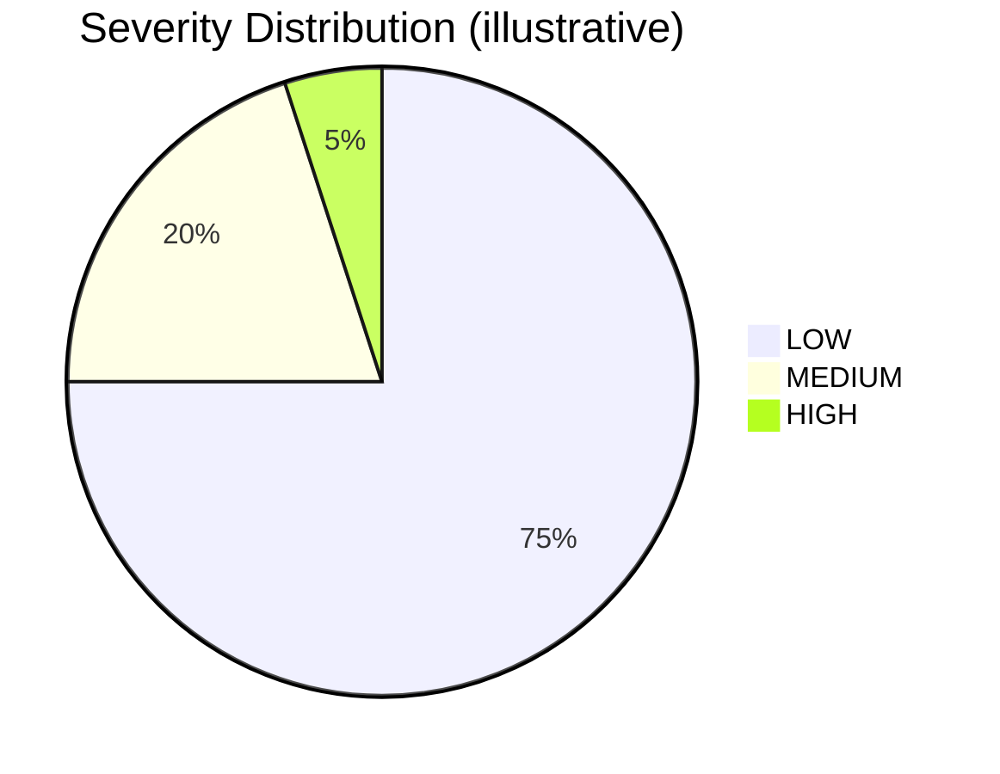

# Weekly Trend Analytics

`python -m opsrisk weekly` generates a Markdown report summarizing risk trends from the last 7 days of scored articles. The report is written to `briefs/weekly/YYYY-MM-DD.md`.

## Report Sections

### Executive Summary

Total articles scanned, number of distinct sources, and severity distribution (high / medium / low) for the week.

### Top Signals

The 5 highest-scoring articles by composite score, with severity label, source, and score.

### Average Scores by Source

Each source's article count and mean composite score, sorted descending. This reveals which publications consistently produce high-signal content versus noise.

### Average Disruption Risk by Category

For each source category (logistics, procurement, operations), the mean disruption risk score. Categories with higher averages suggest the topic area is generating more actionable disruption signals.

### Source Concentration

Article count and percentage share for each source, mirroring the `validate` command's source concentration diagnostic. Monitors feed balance over time.

### Risk Themes

Eight broad risk categories are checked against article titles. Each article can match multiple themes. The table shows how many articles touched each theme and the percentage of the weekly total:

| Theme | Example Keywords |
|-------|------------------|
| Tariffs & Trade Policy | tariff, trade war, sanctions, embargo |
| Labor Disruptions | strike, labor dispute, layoff, union |
| Logistics & Shipping | port congestion, shipping delay, freight, rerouting |
| Supplier & Parts Risk | shortage, bankruptcy, recall, supplier |
| Geopolitical Conflict | war, conflict, military |
| Natural Disasters | hurricane, earthquake, flood, wildfire, typhoon |
| Cyber & Security | cyberattack, ransomware, data breach |
| Market & Financial Pressure | inflation, recession, profit warning, margin squeeze |

These are display-only aggregates and do not affect article scoring.

### Data Quality Note

Each report includes a timestamp and a reminder to run `python -m opsrisk validate` for full integrity checks.

## Visual Elements

The weekly report uses two visual enhancements that render in any Markdown viewer:

### ASCII Bar Charts

Horizontal bars using Unicode block characters (`\u2588` filled, `\u2591` light shade) appear in four sections:

| Section | Bar represents | Scale |
|---------|----------------|-------|
| Executive Summary | Severity volume per tier (HIGH/MEDIUM/LOW) | Proportional to total articles |
| Avg Scores by Source | Mean composite score per source | Out of 10 |
| Avg Disruption Risk by Category | Mean disruption risk per category | Out of 10 |
| Risk Themes | Article count per theme | Proportional to total articles |

Example of a source bar:
```
Transport Topics   ████░░░░░░░░░░░░░░░░  1.81
```

### Top Risk Signal Card

After the top 5 signals table, the report shows a card for the highest-scoring article with per-dimension score bars. Each dimension bar runs from 0 to 10:

```
| Dimension | Score | Bar |
|-----------|-------|-----|
| Disruption Risk | 10.0 | ████████████████████ |
| Business Impact | 1.0 | ██░░░░░░░░░░░░░░░░░░ |
```

### Mermaid Visualization

GitHub renders Mermaid diagrams natively in Markdown. The pipeline flowchart uses this format. An example severity pie chart (illustrative):



The pie chart is a static example; the actual weekly report uses ASCII bars for precise values.

## Example

```
# OpsRisk Radar — Weekly Trend Report
**2026-04-23 to 2026-04-29**

## Executive Summary

Scanned 202 signal(s) from 6 source(s). 0 high-risk, 1 medium-risk,
201 low-risk signal(s) identified.

Severity distribution:
  LOW      ████████████████████ 201
  MEDIUM   ██                   1
  HIGH     ░░░░░░░░░░░░░░░░░░░░ 0
```

## Implementation

The report uses simple SQL aggregation and string matching. No scoring logic is invoked during report generation. All data comes from the existing `articles` and `scores` tables.
